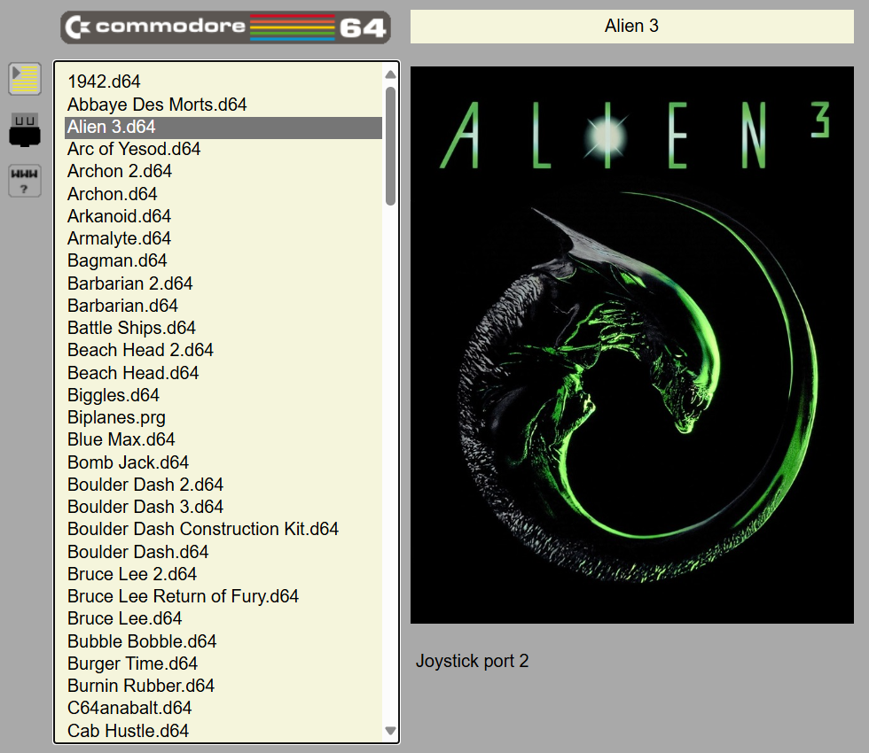
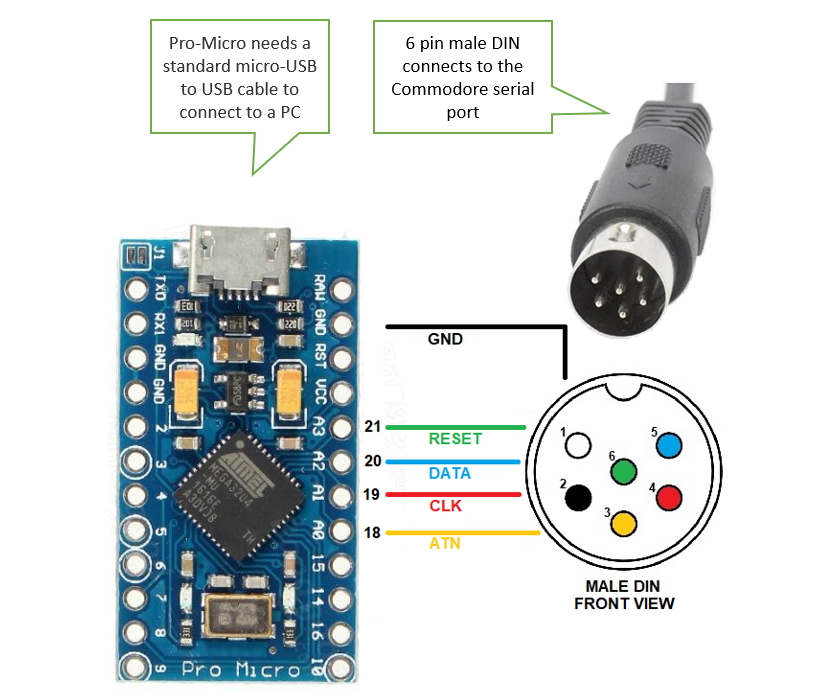
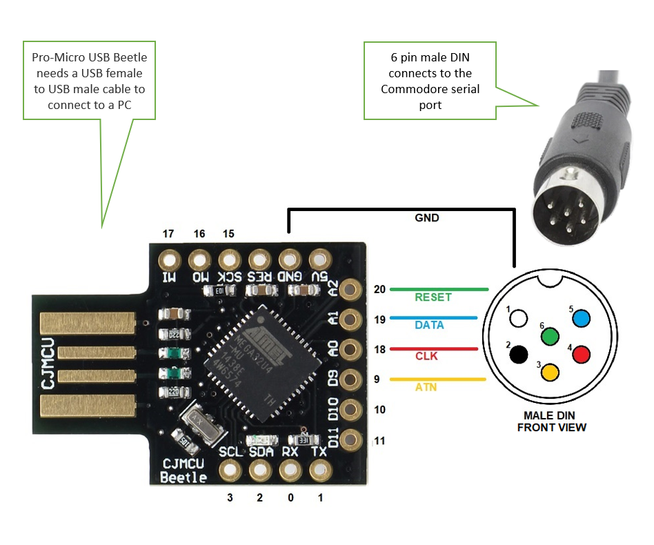
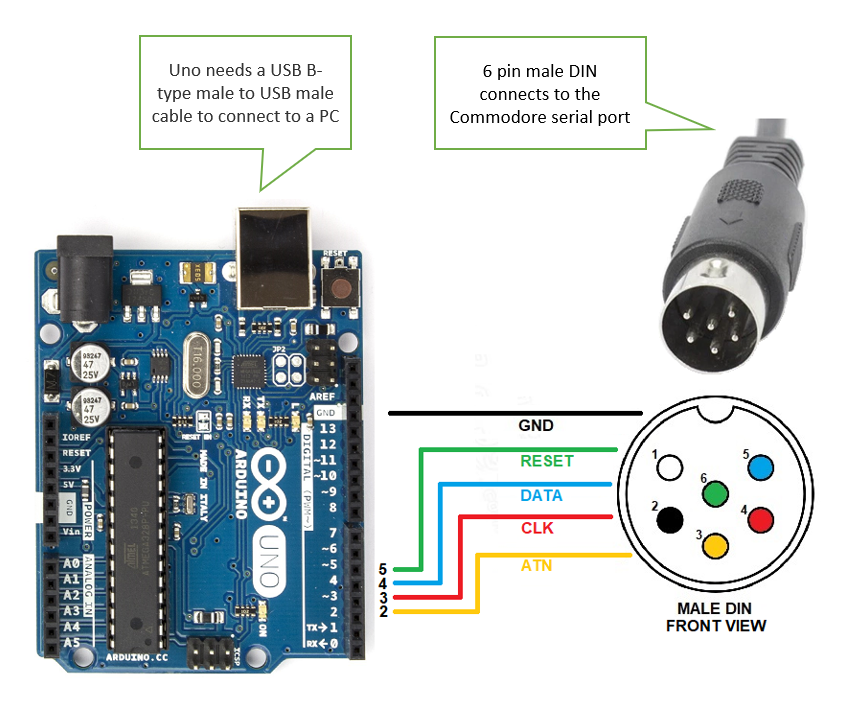
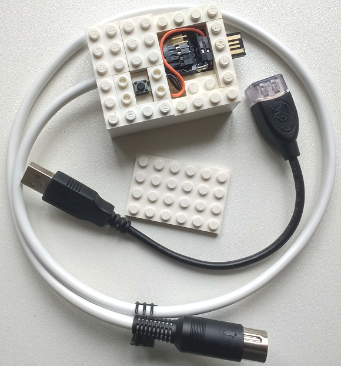

# Commodore computer loader using standalone HTML/JavaScript and Arduino
This project offers a simple and cost-effective way of loading software onto a Commodore 64 or Commodore Vic-20 retro-computer. It consists of two main components, an Arduino microcontroller which connects to the Commodore serial port, and local HTML/JavaScript programs which provide a front-end to select programs from.



Main features
- Load D64, PRG and T64 program files, including multi-loaders to your Commodore
- Select programs using a simple GUI
- Works well for many C64 games and Vic-20 games requiring memory expansion e.g. a 35K switchable memory expansion
- Works with the C64 EPYX fast-load cartridge
- Runs from local HTML/JavaScript files. No webserver is required

## Hardware Requirements
- A web browser which supports the Web Serial API. Chrome, Edge and Opera running on a Windows 11 PC were used for testing
- For connecting to the Commodore, a 5V 16Mhz Arduino / clone microcontroller is used. This may be an ATmega32U4 device (Micro, Pro-Micro and variations) or ATmega328P device (Uno, Nano)
- The connections required are simple, go to the Hardware Interface section for details and diagrams

## Installation
- Copy this project to a folder on a PC
- Download and install the [Arduino IDE](https://www.arduino.cc/en/software)
- Use the Arduino IDE to open the [sketch](./commodore_sketch/commodore_sketch.ino)
- If using the C64 EPYX fast-load cartridge, additional steps are needed. Refer to that section for details
- Select the Arduino board and port. Pro-micro clones are often mentioned as being Arduino Leonardo compliant. If yours is like this, choose Arduino Leonardo as your board
- Compile and upload the Arduino sketch
- Edit the settings section at the top of the [cbmloader.js](./cbmloader.js) program file with the Arduino pins and serial device filters used
- Box art images are optional, but if used must be located in the `resources/art/c64` and `resources/art/vic20` subfolders and given the same name as their corresponding program with a `-image.jpg` extension, e.g. `Blue Max.d64` should have an associated image called `Blue Max-image.jpg`
- Optional help information can be added into the `resources/info_c64.js` and `resources/info_vic20.js` files for each program as shown in the example below
```
const info_c64 = {
,"Alien 3.d64":"Joystick port 2"
,"Blue Max.d64":"Joystick port 2"
,"Boulder Dash.d64":"Joystick port 1"
}
```

## Usage
- Ensure all the physical connections are made between the Commodore, Arduino and PC
- Remember that the Commodore should always be turned off when physically connecting to it
- Open `index.html` in Chrome, Edge or Opera
- Click the `Open files` icon then navigate to a folder containing D64, PRG and T64 programs
- To select all files, click on one of them then press `CTRL + A` together and then choose `Open`
- Turn the Commodore on and click the `Connect` icon to select an Arduino device and connect to it
- On the Commodore, issue the required `LOAD` command. See commands section below

| Command | Description |
| ------- | ----------- |
| `LOAD "*",8` | Used to load the selected D64, PRG or T64 based program. The disk drive number is always 8 |
| `LOAD "*",8,1` | This version of the load command is needed for many Vic-20 games and some C64 games. The program will be loaded at the memory location given in the first two bytes of a PRG file |
| `LOAD "ABC*",8` | For D64, T64 programs, used to load a program starting with certain characters (e.g. `ABC`) |
| `/*` | Shortcut for `LOAD "*",8,1` with C64 EPYX fast-load cartridge only |
| `RUN` | Runs the program following `LOAD` above |
| `LOAD "$",8` | Loads a directory listing of the contents of a D64 or T64 file |
| `LIST` | Lists the directory contents after the above |
| `$` | Shortcut for `LOAD "$",8` with C64 EPYX fast-load cartridge only |

- The `Search web` icon searches for the selected program on the Internet, providing a shortcut to get more information about it
- Directory listings showing the contents of `D64` and `T64` files are displayed by clicking on the associated art image. They are automatically displayed if no art exists for a program

> C64 sample list of working games
```
1942, Abbaye Des Morts, Arc of Yesod, Archon 1 and 2, Arkanoid, Armalyte, Barbarian 1 and 2, Beach Head 1 and 2, Biggles, Blue Max, Bomb Jack, Boulder Dash series, Bruce Lee, Bruce Lee Return of Fury, Bubble Bobble, Burnin Rubber, Cauldron, Cliff Hanger, Commando, Dig Dug, Dino Eggs, Donkey Kong Junior, Donkey Kong, Druid, Emlyn Hughes International Soccer, Empire Strikes Back, Fist 2, Fix-it Felix Jr, Football Manager, Fort Apocalypse 2, Galencia, Ghostbusters, Ghosts 'n Goblins, Green Beret, Heli Rescue, Impossible Mission 1 and 2, International Football, International Karate, International Karate Plus, Lady Pac, Last Ninja 1 and 2, Lock 'n' Chase, Lode Runner, Mayhem in Monsterland, Microprose Soccer, Millie and Molly, Moon Cresta, Outrun, Pacman Arcade, Pac-Man, Paperboy, Paradroid, Pitstop 1 and 2, Pooyan, Popeye, Raid Over Moscow, Rambo First Blood Part 2, Rampage, Rick Dangerous, Robin of the Wood, Rodland, R-Type, Spy Hunter, Spy vs Spy series, Super Mario Bros, Super Pipeline 1 and 2, The Great Giana Sisters, The Train Escape to Normandy, Turrican, Uridium, Volfied, Way of the Exploding Fist, Who Dares Wins 1 and 2, Wizard of Wor, Wizball, Yie Ar Kung-Fu
```
> Vic-20 sample list of working games (most with a memory expansion)
```
Adventure Land, AE, Alien Blitz, Amok, Arcadia, Astro Nell, Astroblitz, Atlantis, Attack of the Mutant Camels, Avenger, Bandits, Battlezone, Black Hole, Blitz, Buck Rogers, Capture the Flag, Cheese and Onion, Choplifter, Cosmic Cruncher, Creepy Corridors, Defender, Demon Attack, Donkey Kong, Dragonfire, Escape 2020, Final Orbit, Galaxian, Get More Diamonds, Gridrunner, Help Bodge, Hero, Jelly Monsters, Jetpac, Lala Prologue, Laser Zone, Lode Runner, Manic Miner, Metagalactic Llamas, Mickey the Bricky, Miner 2049er, Mission Impossible, Moon Patrol, Moons of Jupiter, Mosquito Infestation, Mountain King, Ms Pac-Man, Nibbler, Omega Race, Pac-Man, Pentagorat, Perils of Willy, Pharaoh's Curse, Pirate Cove, Polaris, Pool, Pumpkid, Radar Rat Race, Rigel Attack, Robotron, Robots Rumble, Rockman, Rodman, Sargon 2 Chess, Satellite Patrol, Satellites and Meteorites, Scorpion, Seafox, Serpentine, Shamus, Skramble, Skyblazer, Spider City, Spiders of Mars, Squish'em, Star Battle, Star Defence, Super Amok, Sword of Fargoal, Tenebra Macabre, TenTen, Tetris Deluxe, The Count, Traxx, Tutankham, Video Vermin, Voodoo Castle, Zombie Calavera
```

Note that load times in disk drive mode are not fast by modern standards, taking just over a minute for most C64 programs. If the C64 EPYX fast-load cartridge is used, loading takes around 4-5 seconds.

As this is not a 'true' disk drive emulator, there are some related downsides and some things which have not been tested.
- Some program files, typically for the C64, do not load because they require features of the actual disk drive hardware
- Has not been tested with C64 fast-load cartridges other than EPYX fast-load
- Has not been fully tested with programs that use two or more D64 files
- Saving programs or handling disk operations e.g. renaming a file is not currently supported
- This project has used a PAL C64 and Vic-20 for testing, so it's uncertain how this might work on NTSC machines

A program title may have many different roms. If having a problem, try other versions instead, especially for a favourite game.

## Hardware Interface
**Important!** There is potential for variation and errors, so **only proceed if you are content to take on all risks involved**. Some specific points to be aware of:
- The connections to the Commodore and Arduino are essential to get right. Damage to the Commodore and Arduino may result if this isn't done
- This project involves soldering the pin connections for the Commodore and Arduino. Ensure you're confident to do this and that connections will be secure and will not leave pins touching one another

For connecting the Commodore and Arduino, a 6 pin male DIN connector and 5 wire cable (or jumper wires) are needed, both are cheap and readily available on eBay. Soldering wires onto the DIN is a bit tricky, so it's worth checking YouTube videos for tips. Alternatively, 6 pin DIN cables are available but are not that common.

Any digital pins may be used. The ones you choose are defined in the settings section at the top of the cbmloader.js program file. The digital pins used in these diagrams provide a working guide. If using the C64 EPYX fast-load cartridge, refer to the section below before deciding on which pins to use.

> The Pro-Micro needs a standard micro-USB to USB cable to connect to your computer


> The Pro-Micro USB Beetle needs a USB female to USB male cable to connect to your computer


> The Uno needs a USB B-type male to USB male cable to connect to your computer


Having a reset button is useful for restarting the Arduino which is occasionally needed if a program fails in loading. The Arduino Micro and Uno already have one but many Arduino clones do not. Making one is easy, a momentary button needs to be connected between the reset pin (usually labelled RES or RST) and ground pin (GND). Alternatively, the Arduino needs to be re-plugged in to reset it.

> A completed, working example using a Pro-Micro USB Beetle with a reset button mounted in a Lego case


## C64 EPYX fast-load cartridge installation steps
The C64 EPYX fast-load cartridge requires cycle-exact timing to work. For this, AVR assembler code is needed which may need minor amendment for the choice of input/output pins used on the Arduino.

### Arduino board pin to AVR chip pin mappings
Arduino board pins are mapped to pins on the AVR chip. The AVR assembler code requires the AVR-chip pin mappings not the Arduino board pins, so a slight code change is needed to accommodate this.

The board pin to AVR-chip pin mappings are found in files created when the Arduino IDE is installed, examples below for Windows Arduino IDE v2.3.2.

`Leonardo / Pro-Micro`: C:\Users\xxxx\AppData\Local\Arduino15\packages\arduino\hardware\avr\1.8.6\variants\leonardo\pins_arduino.h

`Standard / Uno`: C:\Users\xxxx\AppData\Local\Arduino15\packages\arduino\hardware\avr\1.8.6\variants\standard\pins_arduino.h

In the `~\leonardo\pins_arduino.h` file for instance, digital pin 9 (D9) maps to AVR pin 5 on port B (PB5). The AVR pin input and output port names are also needed (PINB and PORTB for PB5).

### Determine the AVR-chip mapping for the Arduino pins being used
The AVR-chip pin and port mapping depend on the choice of Arduino board pins. They do not depend on the type of Arduino, so although an Uno and Pro-Micro are mentioned in the examples below, it is just the Arduino board pin choice that matters.

The simplest scenario is where all board pins share the same AVR-chip input and output port names, such as the example below used for the Arduino Uno in this case.

| Pin | Description |
| ------- | ----------- |
| `Atn` | board pin 2 (D2) is PD2. The PD pins have an input port name PIND, output PORTD, mode (not used here) DDRD |
| `Clock` | board pin 3 (D3) is PD3 |
| `Data` | board pin 4 (D4) is PD4 |
| `Reset` | board pin 5 (D5) is PD5 |

A split port name example is below, used in this case for the Pro-Micro / Leonardo.

| Pin | Description |
| ------- | ----------- |
| `Atn` | board pin 9 (D9) is PB5. The PB pins have an input port name PINB, output PORTB, mode (not used here) DDRB |
| `Clock` | board pin 18 (D20) is PF7. The PF pins have an input port name PINF, output PORTF, mode (not used here) DDRF |
| `Data` | board pin 19 (D20) is PF6 |
| `Reset` | board pin 20 (D20) is PF5 |

Note. Data and clock pins must be on the same input/output port. If they are not, different board pins should be chosen.

### Apply the AVR chip mappings to the epyxfastload files
From the above, find the scenario which best matches your pin selection, create a sketch subfolder and copy existing `epyxfastload.h` and `epyxfastload.cpp` files into it. The `epyxfastload.h` and `epyxfastload.cpp` will come from the `uno` subfolder (example where all pins share the same AVR chip input and output port names) or `promicro` subfolder (example where port names are split).

Amend the `epyxfastload.h` with the pin choices. The `epyxfastload.cpp` may need amendment to change the port labels (to avoid confusion), for example IEC_INPUT_B, IEC_OUTPUT_B may become IEC_INPUT_D, IEC_OUTPUT_D where port D is being used instead of B. A global change/replace in `epyxfastload.h` and `epyxfastload.cpp` will easily do this.

Copy both files into the main sketch folder and compile the sketch.

## Authors and Acknowledgement
The information and code shared by the following developers and sources is gratefully acknowledged:
- [New 1541 emulator for arduino via desktop computer: uno2iec - Commodore 64 (C64) Forum (lemon64.com)](https://www.lemon64.com/forum/viewtopic.php?t=48771&start=0&sid=667319bb48acd56b1d4e0c2296145a84), developer Lars Wadefalk
- [SD2IEC project](https://www.sd2iec.de/), for EPYX fast-load cartridge additions
- [How Does Epyx Fastload Make Loading Faster on a Commodore 64?](https://www.youtube.com/watch?v=pUjOLLvnhjE), YouTube video by Commodore History

## License
[The software is provided under the terms of its MIT license](./LICENSE.txt)

## Project Status
This project is considered working for disk / serial operations loading Commodore D64, PRG and T64 based programs.
Development is ongoing for bug fixes and enhancements.
